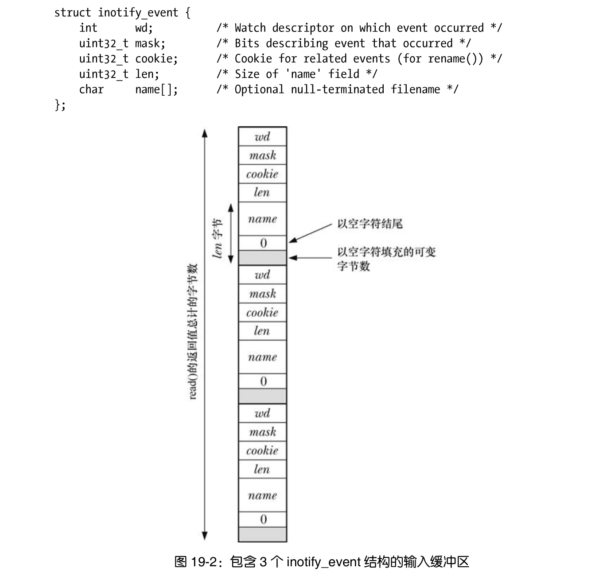

## inotify_init()系统调用可创建一新的 inotify 实例
```c
#include <sys/inotify.h>
int inotify_init(void);
```
inotify_init()会返回一个文件描述符（句柄），用于在后续操作中指代此inotify 实例。

针对文件描述符 fd 所指代 inotify 实例的监控列表，系统调用 inotify_add_watch()既可以
追加新的监控项，也可以修改现有监控项。
```c
#include <sys/inotify.h>
int inotify_add_watch(int fd,const char *pathname,uint32_t mask);
```
系统调用 inotify_rm_watch()会从文件描述符 fd 所指代的 inotify 实例中，删除由 wd 所定义
的监控项。
```c
#include <sys/inotify.h>
int inotify_rm_watch(int fd,uint32_t wd);
```
参数 wd 是一监控描述符，由之前对 inotify_add_watch()的调用返回。

**使用 inotify_add_watch()删除或修改监控项时，位掩码参数 mask 标识了针对给定路径名
（pathname）而要监控的事件。**


## 读取 inotify 事件
将监控项在监控列表中登记后，应用程序可用 read()从 inotify 文件描述符中读取事件，以
判定发生了哪些事件。若时至读取时尚未发生任何事件，read()会阻塞下去，直至有事件产生（除
非对该文件描述符设置了 O_NONBLOCK 状态标志，这时若无任何事件可读，read()将立即失败，
并报错 EAGAIN）。

事件发生后，每次调用 read()会返回一个缓冲区，内含一个或多个如下类型的结构


## 队列限制和 /proc 文件
对 inotify 事件做排队处理，需要消耗内核内存。正因如此，内核会对 inotify 机制的操作
施以各种限制。超级用户可配置/proc/sys/fs/inotify 路径中的 3 个文件来调整这些限制：
- max_queued_events :调用 inotify_init()时，使用该值来为新 inotify 实例队列中的事件数量设置上限。一旦超出
这一上限，系统将生成 IN_Q_OVERFLOW 事件，并丢弃多余的事件。溢出事件的 wd 字段值
为−1。
- max_user_instances :对由每个真实用户 ID 创建的 inotify 实例数的限制值。
- max_user_watches :对由每个真实用户 ID 创建的监控项数量的限制值。

