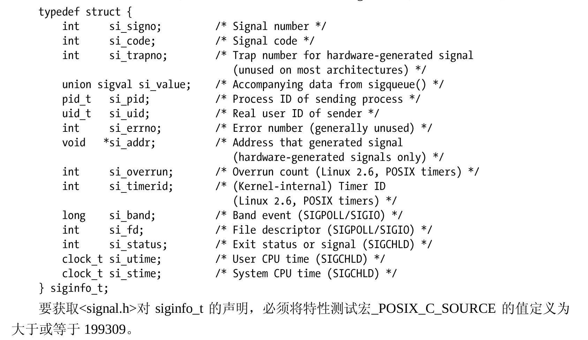

## 
信号是事件发生时对进程的通知机制。有时也称之为软件中断。信号与硬件中断的相似
之处在于打断了程序执行的正常流程，大多数情况下，无法预测信号到达的精确时间。

一个（具有合适权限的）进程能够向另一进程发送信号。信号的这一用法可作为一种同
步技术，甚至是进程间通信（IPC）的原始形式。进程也可以向自身发送信号。然而，发往进
程的诸多信号，通常都是源于内核。引发内核为进程产生信号的各类事件如下。
- 硬件发生异常，即硬件检测到一个错误条件并通知内核，随即再由内核发送相应信号
给相关进程。硬件异常的例子包括执行一条异常的机器语言指令，诸如，被 0 除，或
者引用了无法访问的内存区域。
- 用户键入了能够产生信号的终端特殊字符。其中包括中断字符（通常是 Control-C)、
暂停字符（通常是 Control-Z）。
- 发生了软件事件。例如，针对文件描述符的输出变为有效，调整了终端窗口大小，定
时器到期，进程执行的 CPU 时间超限，或者该进程的某个子进程退出。

信号到达后，进程视具体信号执行如下默认操作之一。
- 忽略信号：也就是说，内核将信号丢弃，信号对进程没有产生任何影响（进程永远都
不知道曾经出现过该信号）。
- 终止（杀死）进程：这有时是指进程异常终止，而不是进程因调用 exit()而发生的正
常终止。
- 产生核心转储文件，同时进程终止：核心转储文件包含对进程虚拟内存的镜像，可将
其加载到调试器中以检查进程终止时的状态。
- 停止进程：暂停进程的执行。
- 于之前暂停后再度恢复进程的执行。

Linux 对标准信号的编号为 1～31。然而，Linux 于 signal(7)手册页中列出的
信号名称却超出了 31 个。


## 信号处理器
信号处理器程序（也称为信号捕捉器）是当指定信号传递给进程时将会调用的一个函数。

调用信号处理器程序，可能会随时打断主程序流程；内核代表进程来调用处理器程序，
当处理器返回时，主程序会在处理器打断的位置恢复执行。

## 发送信号：kill()
与 shell 的 kill 命令相类似，一个进程能够使用 kill()系统调用向另一进程发送信号。
```c
#include <signal.h>
int kill(pid_t pid,int sig);
```
pid 参数标识一个或多个目标进程，而 sig 则指定了要发送的信号。如何解释 pid，要视以
下 4 种情况而定。
- 如果 pid 大于 0，那么会发送信号给由 pid 指定的进程。
- 如果 pid 等于 0，那么会发送信号给与调用进程同组的每个进程，包括调用进程自身。 （SUSv3 声明，除去“一组未予明确的系统进程” 之外，应将信号发送给同一进程组
中的所有进程，且这一排除条件同样适用于余下的两种情况。）
- 如果 pid 小于−1，那么会向组 ID 等于该 pid 绝对值的进程组内所有下属进程发送
信号。向一个进程组的所有进程发送信号在 shell 作业控制中有特殊用途。
- 如果 pid 等于−1，那么信号的发送范围是：调用进程有权将信号发往的每个目标进程，
除去 init（进程 ID 为 1）和调用进程自身。如果特权级进程发起这一调用，那么会发
送信号给系统中的所有进程，上述两个进程除外。显而易见，有时也将这种信号发送
方式称之为广播信号。
（SUSv3 并未要求将调用进程排除在信号的接收范围之外，Linux
此处所遵循的是 BSD 系统的语义。）

## 检查进程的存在
kill()系统调用还有另一重功用。若将参数 sig 指定为 0（即所谓空信号）
，则无信号发送。
相反，kill()仅会去执行错误检查，查看是否可以向目标进程发送信号。从另一角度来看，这
意味着，可以使用空信号来检测具有特定进程 ID 的进程是否存在。

## 发送信号的其他方式：raise()和 killpg()
有时，进程需要向自身发送信号。raise()函数就执行了这一任务。
```c
#include <signal.h>
int raise(int sig);
```
killpg()函数向某一进程组的所有成员发送一个信号。
```c
#include <signal.h>
int killpg(pid_t pgrp, int sig);
```

## 显示信号描述
每个信号都有一串与之相关的可打印说明。这些描述位于数组 sys_siglist 中。例如，可以
用 sys_siglist[SIGPIPE]来获取对 SIGPIPE 信号（管道断开）的描述。

strsignal()函数对 sig 参数进行边界检查，然后返回一枚指针，指向针对该信号的可打印描
述字符串，或者是当信号编号无效时指向错误字符串。

psignal()函数（在标准错误设备上）所示为 msg 参数所给定的字符串，后面跟有一个冒号，
随后是对应于 sig 的信号描述。和 strsignal()一样，psignal()函数也对本地设置敏感。

```c
#include <signal.h>
extern const char *const sys_siglist[];

#include <string.h>
char *strsignal(int sig);

void psignal(int sig,const char *msg);
```

## 信号集
许多信号相关的系统调用都需要能表示一组不同的信号。多个信号可使用一个称之为信号集的数据结构来表示，其系统数据类型为 sigset_t.。SUSv3
规定了一系列函数来操纵信号集，现在将描述这些函数。

sigemptyset()函数初始化一个未包含任何成员的信号集。sigfillset()函数则初始化一个信号
集，使其包含所有信号（包括所有实时信号）。
```c
#include <signal.h>
int sigemptyset(sigset_t *set);
int sigfillset(sigset_t *set);
```
信号集初始化后，可以分别使用 sigaddset()和 sigdelset()函数向一个集合中添加或者移除
单个信号。
```c
#include <signal.h>
int sigaddset(sigset_t *set,int sig);
int sigdelset(sigset_t *set,int sig);
```
sigismember()函数用来测试信号 sig 是否是信号集 set 的成员。
```c
#include <signal.h>
int sigismember(const sigset_t *set,int sig);
```

## 信号掩码（阻塞信号传递）
内核会为每个进程维护一个信号掩码，即一组信号，并将阻塞其针对该进程的传递。

将遭阻塞的信号发送给某进程，那么对该信号的传递将延后，直至从进程信号掩码中移除
该信号，从而解除阻塞为止。

**信号掩码实际属于线程属性，在多线程进程
中，每个线程都可使用 pthread_sigmask()函数来独立检查和修改其信号掩码。**

使用 sigprocmask()函数既可修改进程的信号掩码，又可获取现有掩码，或者两重功效兼
具。how 参数指定了 sigprocmask()函数想给信号掩码带来的变化。
```c
#include <signal.h>
int sigprocmask(int how,const sigset_t *set,sigset_t *oldset);
```
- SIG_BLOCK :将 set 指向信号集内的指定信号添加到信号掩码中。换言之，将信号掩码设置为其当前值
和 set 的并集。
- SIG_UNBLOCK :将 set 指向信号集中的信号从信号掩码中移除。即使要解除阻塞的信号当前并未处于阻塞
状态，也不会返回错误。
- SIG_SETMASK :将 set 指向的信号集赋给信号掩码。

系统将忽略试图阻塞 SIGKILL 和 SIGSTOP 信号的请求。如果试图阻塞这些信号，
sigprocmask()函数既不会予以关注，也不会产生错误。这意味着，可以使用如下代码来阻塞除
SIGKILL 和 SIGSTOP 之外的所有信号：
```c
sigfillset(&block_set);
if (sigprocmask(SIG_BLOCK,&block_set,NULL)==-1){
    errExit("sigpromask");
}
```

## 处于等待状态的信号
如果某进程接受了一个该进程正在阻塞的信号，那么会将该信号填加到进程的等待信号
集中。当（且如果）之后解除了对该信号的锁定时，会随之将信号传递给此进程。为了确定
进程中处于等待状态的是哪些信号，可以使用 sigpending()。
```c
#include <signal.h>
int sigpending(sigset_t *set);
```
sigpending()系统调用为调用进程返回处于等待状态的信号集，并将其置于 set 指向的
sigset_t 结构中。随后可以使用sigismember()函数来检查 set。


## 不对信号进行排队处理
**等待信号集只是一个掩码，仅表明一个信号是否发生，而未表明其发生的次数。换言之，
如果同一信号在阻塞状态下产生多次，那么会将该信号记录在等待信号集中，并在稍后仅传
递一次。**


## 改变信号处置：sigaction ()
除去 signal()之外，sigaction()系统调用是设置信号处置的另一选择。虽然 sigaction()的用
法比之 signal()更为复杂，但作为回报，也更具灵活性。尤其是，sigaction()允许在获取信号处置
的同时无需将其改变，并且，还可设置各种属性对调用信号处理器程序时的行为施以更加精
准的控制。
```c
#include <signal.h>
int sigcation(int sig,const struct sigcation *act,struct sigcation *oldact);
```
sig 参数标识想要获取或改变的信号编号。该参数可以是除去 SIGKILL 和 SIGSTOP 之外的
任何信号。


## 等待信号：pause()
调用 pause()将暂停进程的执行，直至信号处理器函数中断该调用为止（或者直至一个未
处理信号终止进程为止）。
```c
#include <signal.h>
int pause(void);
```
处理信号时，pause()遭到中断，并总是返回−1，并将 errno 置为 EINTR。

在int_quit.c中，使用了pause()来等待信号。

## 
**不会对信号进行排队处理。在处理器函数执行期间，如果多次产生同类信号，那么仍然会将其标记
为等待状态，但稍后只会传递一次。
信号的这种“失踪”方式无疑将影响对信号处理器函数的设计。首先，无法对信号的产
生次数进行可靠计数。其次，在为信号处理器函数编码时可能需要考虑处理同类信号多次产
生的情况。**

### 可重入函数和异步信号安全函数
如果同一个进程的多条线程可以同时安全地调用某一函数，那么该函数就是可重入的。
此处，“安全”意味着，无论其他线程调用该函数的执行状态如何，函数均可产生预期结果。

更新全局变量或静态数据结构的函数可能是不可重入的。只用到本地变量的函数肯定是可重入的。
如果对函数的两个调用（例如：分别由两条执行线程发起）同时试图更新同一全局变
量或数据类型，那么二者很可能会相互干扰并产生不正确的结果。

### 标准的异步信号安全函数
异步信号安全的函数是指当从信号处理器函数调用时，可以保证其实现是安全的。如
果某一函数是可重入的，又或者信号处理器函数无法将其中断时，就称该函数是异步信号安全的。

### 全局变量和 sig_atomic_t 数据类型
信号处理器函数可能会随时修改全局变量—只要主程序能够正确处理这种可能性，共享全局变
量就是安全的。

如果使用 longjmp()来退出信号处理器函数，那么信号掩码会发生什么情况呢？这取决于
特定 UNIX 实现的血统。在 System V 一脉中，longjmp()不会将信号掩码恢复，亦即在离开处
理器函数时不会对遭阻塞的信号解除阻塞。

鉴于两大 UNIX 流派之间的差异，POSIX.1-1990 选择不对 setjmp()和 longjmp()的信号掩
码处理进行规范，而是定义了一对新函数：sigsetjmp()和 siglongjmp()，针对执行非本地跳转
时的信号掩码进行显式控制。
```c
#include <setjmp.h>
int sigsetjmp(sigjmp_buf env,int savesigs);
void siglongjmp(sigjmp_buf env,int val);
```

## SA_SIGINFO 标志
如果在使用 sigaction()创建处理器函数时设置了 SA_SIGINFO 标志，那么在收到信号时处
理器函数可以获取该信号的一些附加信息。为获取这一信息，需要将处理器函数声明如下：
```c
void handler(int sig,siginfo_t *siginfo,void *ucontext);
```
### 结构 siginfo_t
在以 SA_SIGINFO 标志创建的信号处理器函数中，结构 siginfo_t 是其第 2 个参数

### 参数 ucontext
以 SA_SIGINFO 标志所创建的信号处理器函数，其最后一个参数是 ucontext，一个指向
ucontext_t 类型结构（定义于<ucontext.h>）的指针。

该结构提供了所谓的用户上下文信息，用于描述调用
信号处理器函数前的进程状态，其中包括上一个进程信号掩码以及寄存器的保存值，例如程
序计数器（cp）和栈指针寄存器（sp）。

## 系统调用的中断和重启
在 Linux 中，如果采用 SA_RESTART 标志来创建系统处理器函数，则如下阻塞的系统调用
（以及构建于其上的库函数）在遭到中断时是可以自动重启的。
- 用来等待子进程（26.1 节）的系统调用：wait()、waitpid()、wait3()、wait4()和 waitid()。
- 访问慢速设备时的 I/O 系统调用：read()、readv()、write()、writev()和 ioctl()。如果在
收到信号时已经传递了部分数据，那么还是会中断输入输出系统调用，但会返回成功
状态：一个整型值，表示已成功传递数据的字节数。
- 系统调用 open()，在可能阻塞的情况下（例如，如 44.7 节所述，在打开 FIFO 时）。
- 用于套接字的各种系统调用：accept()、accept4()、connect()、send()、sendmsg()、sendto()、
recv()、recvfrom()和 recvmsg()。
（在 Linux 中，如果使用 setsockopt()来设置超时，这
些系统调用就不会自动重启。更多细节请参考 signal(7)手册页。）
- 对 POSIX 消息队列进行 I/O 操作的系统调用：mq_receive()、mq_timedreceive()、
mq_send()和 mq_timedsend()。
- 用于设置文件锁的系统调用和库函数：flock()、fcntl()和 lockf()。
- Linux 特有系统调用 futex()的 FUTEX_WAIT 操作。
- 用于递减 POSIX 信号量的 sem_wait()和 sem_timedwait()函数。
（在一些 UNIX 实现上，
如果设置了 SA_RESTART 标志，sem_wait()就会重启。）
- 用于同步 POSIX 线程的函数：pthread_mutex_lock()、pthread_mutex_trylock()、pthread_
mutex_timedlock()、pthread_cond_wait()和 pthread_cond_timedwait()。

### 为信号修改 SA_RESTART 标志
函数 siginterrupt()用于改变信号的 SA_RESTART 设置
```c
#include <setjmp.h>
int siginterrupt(int sig,int flag);
```
若参数 flag 为真（1），则针对信号 sig 的处理器函数将会中断阻塞的系统调用的执行。如
果 flag 为假（0），那么在执行了 sig 的处理器函数之后，会自动重启阻塞的系统调用。

## 以同步方式等待信号
如何结合信号处理器和 sigsuspend()来挂起一个进程的执行，直至传来一个
信号。然而，这需要编写信号处理器函数，还需要应对信号异步传递所带来的复杂性。对于
某些应用而言，这种方法过于繁复。作为替代方案，可以利用 sigwaitinfo()系统调用来同步接
收信号。

```c
#include <signal.h>
int sigwaitinfo(const sigset_t *set,siginfo_t *info);
```


## 
某些信号会引发进程创建一个核心转储文件，并终止进程。核心转储所包含的信息可供
调试器检查进程终止时的状态。默认情况下，对核心转储文件的命名为 core，但 Linux 提供了
/proc/sys/kernel/core_pattern 文件来控制对核心转储文件的命名。

