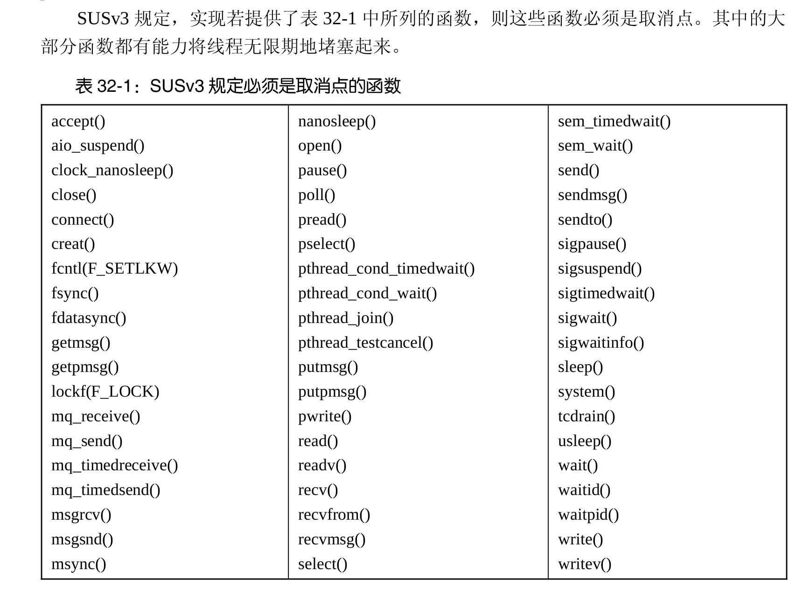

## 
默认情况下，线程是可连接的(joinable)，也就是说，当线程退出时，其他线程可以通过调
用 pthread_join()获取其返回状态。有时，程序员并不关心线程的返回状态，只是希望系统在
线程终止时能够自动清理并移除之。在这种情况下，可以调用 pthread_detach()并向 thread 参
数传入指定线程的标识符，将该线程标记为处于分离（detached）状态。

一旦线程处于分离状态，就不能再使用 pthread_join()来获取其状态，也无法使其重返“可
连接”状态。

## 线程取消
程序中的多个线程会并发执行，每个线程各司其职，直至其决意退出，
随即会调用函数 pthread_exit()或者从线程启动函数中返回。
有时候，需要将一个线程取消（cancel）。亦即，向线程发送一个请求，要求其立即退出。

函数 pthread_cancel()向由 thread 指定的线程发送一个取消请求。
```c
#include <pthread.h>
int pthread_cancel(pthread_t thread);
```
函数 pthread_setcancelstate()和 pthread_setcanceltype()会设定标志，允许线程对取消请求的
响应过程加以控制。
```c
#include <pthread.h>
int pthread_setcancelstate(int stat,int *oldstat);
int pthread_setcanceltype(int type,int *oldtype);
```

## 取消点
若将线程的取消性状态和类型分别置为启用和延迟，仅当线程抵达某个取消点（cancellation
point）时，取消请求才会起作用。取消点即是对由实现定义的一组函数之一加以调用。


## 操作线程信号掩码  向线程发送信号
刚创建的新线程会从其创建者处继承信号掩码的一份拷贝。线程可以使用 pthread_sigmask()来改
变或/并获取当前的信号掩码。除了所操作的是线程信号掩码之外，pthread_sigmask()与 sigprocmask()的用法完全相同

函数 pthread_kill()向同一进程下的另一线程发送信号 sig。目标线程由参数 thread 标识。

Linux 特有的函数 pthread_sigqueue()将 pthread_kill()和 sigqueue()的功能合二为一
```c
#inlcude <signal.h>
int pthread_sigmask(int how,const sigset_t *set,sigset_t *oldset);
int pthread_kill(pthread_t thread,int sig);
#define _GNU_SOURCE
int pthread_sigqueue(pthread_t thread,int sig,const union sigval value);
```
因为仅在同一进程中可保证线程 ID 的唯一性 ，所以无法调用 pthread_ kill()向其他进程中的线程发送信号。
sig 表示将要发送的信号，thread 标识目标线程。参数 value 则指
定了伴随信号的数据，其使用方式与函数 sigqueue()中的对应参数相同。


